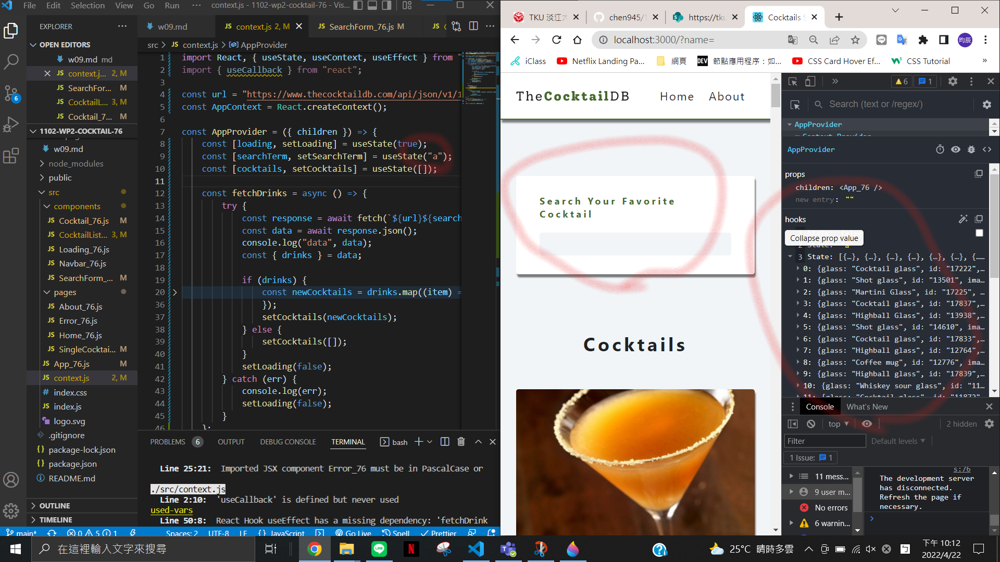
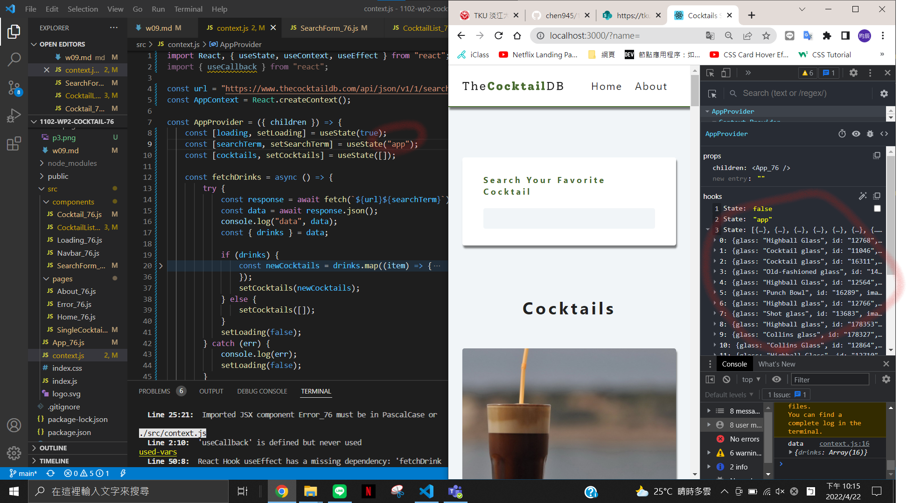
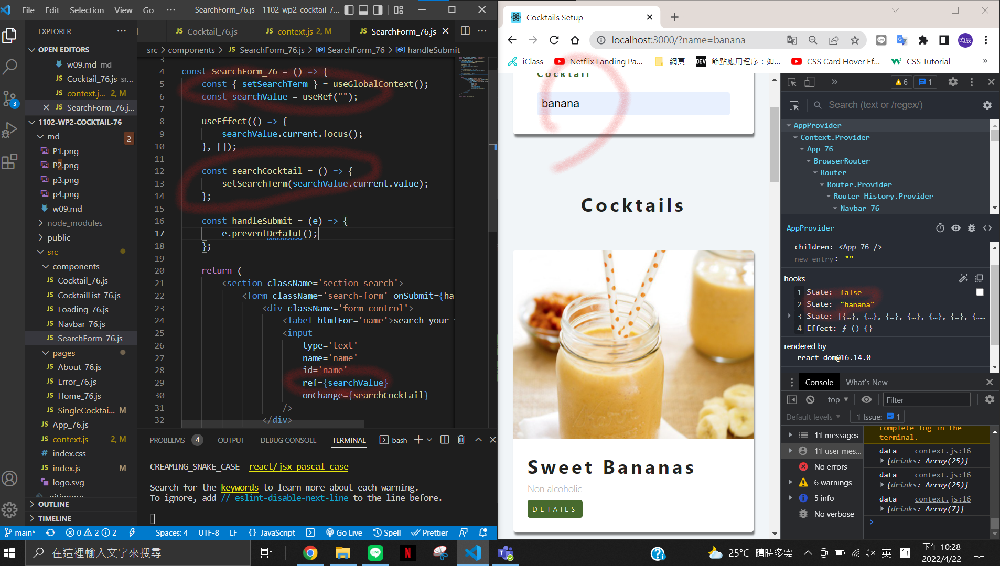

### P1: initial setup, change component name by adding xx

### P2 <About_xx /> <Error_xx /> <Navbar_xx />

### P3 finish context.js and fetch data shown in DevTools

### P4 Show Cocktails with your own searchTerm

### P5 Show Cocktails using searchTerm

